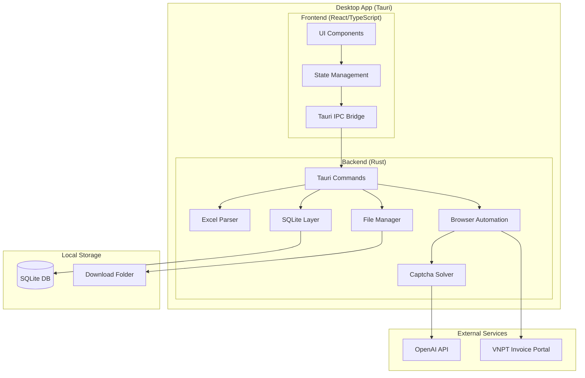
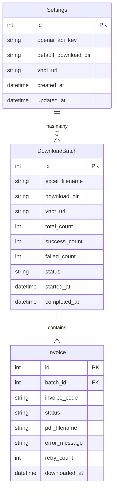

# System Design & Architecture

## Architecture Overview
**What is the high-level system structure?**



### Key Components
| Component | Technology | Responsibility |
|-----------|------------|----------------|
| Frontend | React + TypeScript + Tailwind | UI, user interactions, state management |
| Backend | Rust + Tauri | Business logic, browser automation, file I/O |
| Browser Engine | headless_chrome (Rust) | Navigate VNPT, fill forms, download PDFs |
| Excel Parser | calamine (Rust) | Parse .xlsx files, extract invoice codes, detect VNPT portal URL |
| Database | SQLite (rusqlite) | Store settings, download history |
| Captcha Solver | OpenAI API | Solve VNPT captcha images |

### Technology Stack Rationale
- **Tauri over Electron**: Smaller bundle size (~10MB vs ~150MB), better performance, Rust backend
- **React**: Familiar, large ecosystem, good Tauri integration
- **headless_chrome**: Native Rust, no Python dependency, production-ready
- **SQLite**: Simple, no external server, perfect for local app

## Data Models
**What data do we need to manage?**

### Core Entities



### Data Schemas

**Settings Table**
```sql
CREATE TABLE settings (
    id INTEGER PRIMARY KEY,
    openai_api_key TEXT NOT NULL,
    default_download_dir TEXT NOT NULL,
    vnpt_url TEXT DEFAULT 'https://3701642642-010-tt78.vnpt-invoice.com.vn/HomeNoLogin/SearchByFkey',
    created_at DATETIME DEFAULT CURRENT_TIMESTAMP,
    updated_at DATETIME DEFAULT CURRENT_TIMESTAMP
);
```

**DownloadBatch Table**
```sql
CREATE TABLE download_batches (
    id INTEGER PRIMARY KEY,
    excel_filename TEXT NOT NULL,
    download_dir TEXT NOT NULL,
    vnpt_url TEXT NOT NULL,  -- URL used for this batch (from Excel or Settings)
    total_count INTEGER DEFAULT 0,
    success_count INTEGER DEFAULT 0,
    failed_count INTEGER DEFAULT 0,
    status TEXT DEFAULT 'pending', -- pending, in_progress, completed, cancelled
    started_at DATETIME,
    completed_at DATETIME
);
```

**Invoice Table**
```sql
CREATE TABLE invoices (
    id INTEGER PRIMARY KEY,
    batch_id INTEGER NOT NULL,
    invoice_code TEXT NOT NULL,
    status TEXT DEFAULT 'pending', -- pending, downloading, success, failed, skipped
    pdf_filename TEXT,
    error_message TEXT,
    retry_count INTEGER DEFAULT 0,
    downloaded_at DATETIME,
    FOREIGN KEY (batch_id) REFERENCES download_batches(id)
);
```

## API Design
**How do components communicate?**

### Tauri IPC Commands (Frontend → Backend)

```typescript
// Settings
invoke('get_settings'): Promise<Settings>
invoke('save_settings', { settings: Settings }): Promise<void>

// Excel Processing
invoke('parse_excel', { filePath: string }): Promise<ExcelParseResult>
// Returns invoice codes + detected VNPT URL (if found in Excel)

// Download Operations
invoke('start_download', { batchConfig: BatchConfig }): Promise<number> // returns batch_id
invoke('cancel_download', { batchId: number }): Promise<void>
invoke('retry_failed', { batchId: number }): Promise<void>
// Note: pause/resume not implemented in v1.0

// Manual Captcha
invoke('submit_manual_captcha', { invoiceId: number, captcha: string }): Promise<void>

// History
invoke('get_batches', { limit: number, offset: number }): Promise<DownloadBatch[]>
invoke('get_batch_invoices', { batchId: number }): Promise<Invoice[]>
```

### Tauri Events (Backend → Frontend)

```typescript
// Download Progress
listen('download:progress', (event: ProgressEvent) => void)
// { batchId, current, total, percentage }

// Log Messages
listen('download:log', (event: LogEvent) => void)
// { batchId, timestamp, level, message }

// Invoice Status Update
listen('invoice:status', (event: InvoiceStatusEvent) => void)
// { invoiceId, status, pdfFilename?, errorMessage? }

// Captcha Required
listen('captcha:required', (event: CaptchaEvent) => void)
// { invoiceId, invoiceCode, captchaImageBase64 }

// Batch Completed
listen('batch:completed', (event: BatchCompletedEvent) => void)
// { batchId, successCount, failedCount }
```

### Request/Response Types

```typescript
interface Settings {
  openaiApiKey: string;
  defaultDownloadDir: string;
  vnptUrl: string;
}

interface InvoiceCode {
  code: string;
  rowNumber: number;
}

interface ExcelParseResult {
  invoiceCodes: InvoiceCode[];
  detectedUrl: string | null;  // Auto-detected VNPT portal URL from Excel, null if not found
}

interface BatchConfig {
  invoiceCodes: string[];
  downloadDir: string;
  vnptUrl: string;  // URL to use (from Excel detection or Settings)
}

interface DownloadBatch {
  id: number;
  excelFilename: string;
  downloadDir: string;
  vnptUrl: string;
  totalCount: number;
  successCount: number;
  failedCount: number;
  status: 'pending' | 'in_progress' | 'completed' | 'cancelled';
  startedAt: string;
  completedAt?: string;
}

interface Invoice {
  id: number;
  batchId: number;
  invoiceCode: string;
  status: 'pending' | 'downloading' | 'success' | 'failed' | 'skipped';
  pdfFilename?: string;
  errorMessage?: string;
  retryCount: number;
  downloadedAt?: string;
}
```

## Component Breakdown
**What are the major building blocks?**

### Frontend Components

```
src/
├── components/
│   ├── Layout/
│   │   ├── Header.tsx
│   │   ├── Sidebar.tsx
│   │   └── MainContent.tsx
│   ├── Settings/
│   │   ├── SettingsForm.tsx
│   │   └── ApiKeyInput.tsx
│   ├── Upload/
│   │   ├── ExcelUploader.tsx
│   │   └── InvoicePreview.tsx
│   ├── Download/
│   │   ├── DownloadPanel.tsx
│   │   ├── ProgressBar.tsx
│   │   ├── LogViewer.tsx
│   │   └── CaptchaModal.tsx
│   └── History/
│       ├── BatchList.tsx
│       └── BatchDetail.tsx
├── hooks/
│   ├── useSettings.ts
│   ├── useDownload.ts
│   └── useHistory.ts
├── store/
│   └── index.ts (Zustand)
└── App.tsx
```

### Backend Modules (Rust)

```
src-tauri/src/
├── main.rs
├── commands/
│   ├── mod.rs
│   ├── settings.rs
│   ├── excel.rs
│   ├── download.rs
│   └── history.rs
├── services/
│   ├── mod.rs
│   ├── browser.rs        # headless_chrome wrapper
│   ├── captcha.rs        # OpenAI integration
│   ├── excel_parser.rs   # calamine wrapper
│   └── downloader.rs     # Main download orchestration
├── db/
│   ├── mod.rs
│   ├── migrations.rs
│   └── models.rs
└── utils/
    ├── mod.rs
    └── error.rs
```

## Design Decisions
**Why did we choose this approach?**

### Decision 1: Rust Browser Automation vs Embedded WebView
- **Chosen**: headless_chrome (Rust crate)
- **Rationale**:
  - Full control over browser instance
  - Can run truly headless (no UI flicker)
  - Better for automation tasks
- **Alternative Rejected**: Using Tauri WebView
  - WebView is for app UI, not automation
  - Limited control over navigation

### Decision 2: State Management
- **Chosen**: Zustand
- **Rationale**:
  - Simpler than Redux
  - TypeScript-first
  - Perfect for small-medium apps
- **Alternative Rejected**: Redux Toolkit
  - Overkill for this app size

### Decision 3: Sequential vs Parallel Downloads
- **Chosen**: Sequential (one invoice at a time)
- **Rationale**:
  - VNPT likely has rate limiting
  - Easier to handle captcha flow
  - More reliable
- **Alternative Rejected**: Parallel downloads
  - Risk of being blocked
  - Captcha handling becomes complex

### Decision 4: Captcha Image Handling
- **Chosen**: Screenshot element → Base64 → OpenAI Vision API
- **Rationale**:
  - Direct, no need to extract image URL
  - Works regardless of image format
- **Alternative Rejected**: Fetch image URL
  - May require cookies/session handling
  - URL might be dynamic

### Decision 5: VNPT Portal URL Detection
- **Chosen**: Auto-detect from Excel → Fallback to Settings config
- **Rationale**:
  - VNPT portal URL varies per company (different subdomain)
  - Excel files often contain hyperlinks or URL references to the portal
  - Auto-detection reduces manual configuration for users
  - Fallback to Settings ensures app works even when URL not in Excel
- **Detection Strategy**:
  1. Scan Excel for cells containing `vnpt-invoice.com.vn` pattern
  2. Extract full URL if found (e.g., `https://xxx-xxx-xxx.vnpt-invoice.com.vn/...`)
  3. If not found, use URL from Settings
  4. If Settings also empty, prompt user to configure

## Non-Functional Requirements
**How should the system perform?**

### Performance Targets
| Metric | Target |
|--------|--------|
| App startup | < 3 seconds |
| Excel parse (1000 rows) | < 5 seconds |
| Single invoice download | < 30 seconds |
| Memory usage (idle) | < 100 MB |
| Memory usage (active) | < 500 MB |

### Scalability Considerations
- SQLite handles up to millions of records
- Log rotation to prevent unbounded growth
- Batch size limit: 1000 invoices per batch (UX recommendation)

### Security Requirements
- OpenAI API key stored encrypted in SQLite (using Tauri's secure storage if available)
- No telemetry or external data transmission
- Downloaded PDFs stored with original filenames (no path traversal)

### Reliability/Availability
- Graceful handling of network interruptions
- Auto-save progress to SQLite (can resume after crash)
- Retry mechanism for transient failures
- Clear error messages for user troubleshooting
