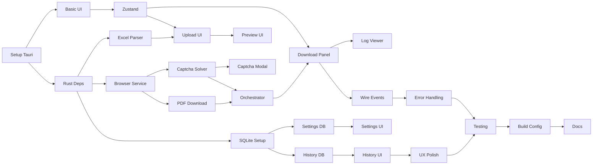

# Project Planning & Task Breakdown

## Milestones
**What are the major checkpoints?**

- [x] **M1: Project Setup & Foundation** - Tauri project scaffolding, basic UI shell
- [x] **M2: Core Backend Services** - Excel parser, browser automation, captcha solver
- [ ] **M3: Download Workflow** - End-to-end download with progress tracking
- [ ] **M4: History & Persistence** - SQLite integration, settings, history UI
- [ ] **M5: Polish & Release** - Error handling, UX improvements, build & package

## Task Breakdown
**What specific work needs to be done?**

### Phase 1: Project Setup & Foundation

- [x] **Task 1.1**: Initialize Tauri project with React + TypeScript
  - Create new Tauri app with `pnpm create tauri-app`
  - Configure TypeScript, Tailwind CSS
  - Setup ESLint, Prettier
  - **Estimate**: 2 hours
  - **Completed**: Feb 12, 2026

- [x] **Task 1.2**: Setup Rust dependencies
  - Add headless_chrome, calamine, rusqlite, reqwest, serde
  - Configure Cargo.toml with correct features
  - **Estimate**: 1 hour
  - **Completed**: Feb 12, 2026

- [x] **Task 1.3**: Create basic UI layout
  - Header with app title
  - Sidebar navigation (Upload, Download, History, Settings)
  - Main content area
  - **Estimate**: 3 hours
  - **Completed**: Feb 12, 2026

- [x] **Task 1.4**: Setup Zustand store
  - Define store structure
  - Create hooks for settings, download state, history
  - **Estimate**: 2 hours
  - **Completed**: Feb 12, 2026

### Phase 2: Core Backend Services

- [x] **Task 2.1**: Implement Excel parser service
  - Parse .xlsx files using calamine
  - Extract "MÃ TRA CỨU" column
  - Handle different Excel formats/layouts
  - Return list of invoice codes
  - **Estimate**: 4 hours
  - **Completed**: Feb 12, 2026

- [x] **Task 2.2**: Implement browser automation service
  - Initialize headless_chrome browser
  - Navigate to VNPT URL
  - Fill invoice code input
  - Handle page load states
  - **Estimate**: 6 hours
  - **Completed**: Feb 12, 2026

- [x] **Task 2.3**: Implement captcha solver service
  - Screenshot captcha element
  - Call OpenAI Vision API (GPT-4o-mini)
  - Parse response and return captcha text
  - **Estimate**: 4 hours
  - **Completed**: Feb 12, 2026

- [x] **Task 2.4**: Implement PDF download logic
  - Find download link on page
  - Trigger download
  - Save to specified directory
  - Handle download errors
  - **Estimate**: 4 hours
  - **Completed**: Feb 12, 2026

- [x] **Task 2.5**: Create download orchestrator
  - Coordinate browser, captcha, download
  - Implement retry logic (3 attempts)
  - Emit progress events via Tauri
  - **Estimate**: 6 hours
  - **Completed**: Feb 12, 2026

### Phase 3: Download Workflow UI

- [ ] **Task 3.1**: Build Excel upload component
  - Drag & drop file upload
  - File validation (.xlsx only)
  - Call parse_excel command
  - Display parsing progress
  - **Estimate**: 3 hours

- [ ] **Task 3.2**: Build invoice preview component
  - Display table of extracted codes
  - Row number, invoice code, status
  - Select/deselect functionality (optional)
  - **Estimate**: 3 hours

- [ ] **Task 3.3**: Build download panel
  - Start/Pause/Cancel buttons
  - Download directory selector
  - Real-time progress bar
  - **Estimate**: 4 hours

- [ ] **Task 3.4**: Build log viewer component
  - Terminal-like scrolling log
  - Color-coded log levels (info, warning, error)
  - Auto-scroll to bottom
  - **Estimate**: 3 hours

- [ ] **Task 3.5**: Build captcha modal
  - Display captcha image (base64)
  - Text input for manual entry
  - Submit/Skip buttons
  - Timeout handling
  - **Estimate**: 3 hours

- [ ] **Task 3.6**: Wire up Tauri events
  - Listen to download:progress, download:log
  - Listen to invoice:status, captcha:required
  - Update Zustand store on events
  - **Estimate**: 3 hours

### Phase 4: History & Persistence

- [ ] **Task 4.1**: Setup SQLite database
  - Create database file in app data directory
  - Run migrations on startup
  - Create tables: settings, download_batches, invoices
  - **Estimate**: 3 hours

- [ ] **Task 4.2**: Implement settings persistence
  - Save/load OpenAI API key
  - Save/load default download directory
  - Save/load VNPT URL
  - **Estimate**: 2 hours

- [ ] **Task 4.3**: Implement download history persistence
  - Create batch record on start
  - Update invoice status during download
  - Update batch counts on completion
  - **Estimate**: 4 hours

- [ ] **Task 4.4**: Build settings UI
  - API key input (masked)
  - Directory picker
  - URL input
  - Save button
  - **Estimate**: 2 hours

- [ ] **Task 4.5**: Build history UI
  - List of past batches with summary
  - Batch detail view with invoice list
  - Filter by status
  - Retry failed invoices button
  - **Estimate**: 4 hours

### Phase 5: Polish & Release

- [ ] **Task 5.1**: Error handling improvements
  - User-friendly error messages
  - Network error recovery
  - Invalid API key handling
  - **Estimate**: 3 hours

- [ ] **Task 5.2**: UX improvements
  - Loading states and skeletons
  - Empty states
  - Confirmation dialogs
  - Tooltips and help text
  - **Estimate**: 3 hours

- [ ] **Task 5.3**: Testing
  - Unit tests for Rust services
  - Integration tests for download flow
  - Manual testing on macOS and Windows
  - **Estimate**: 6 hours

- [ ] **Task 5.4**: Build configuration
  - Configure Tauri build for macOS (.dmg)
  - Configure Tauri build for Windows (.msi)
  - App icons and metadata
  - **Estimate**: 3 hours

- [ ] **Task 5.5**: Documentation
  - User guide (README)
  - Build instructions
  - Troubleshooting guide
  - **Estimate**: 2 hours

## Dependencies
**What needs to happen in what order?**

### External Dependencies
- Tauri CLI (`@tauri-apps/cli`)
- Rust toolchain (stable)
- Node.js 18+
- OpenAI API key (for testing)
- Sample VNPT Excel file (for testing)

## Timeline & Estimates
**When will things be done?**

| Phase | Tasks | Estimated Hours | Target |
|-------|-------|-----------------|--------|
| Phase 1: Setup | 1.1 - 1.4 | 8 hours | Day 1 |
| Phase 2: Backend | 2.1 - 2.5 | 24 hours | Day 2-4 |
| Phase 3: UI | 3.1 - 3.6 | 19 hours | Day 5-7 |
| Phase 4: Persistence | 4.1 - 4.5 | 15 hours | Day 8-9 |
| Phase 5: Polish | 5.1 - 5.5 | 17 hours | Day 10-12 |

**Total Estimated Hours**: ~83 hours

**Buffer**: +20% for unknowns = ~100 hours total

## Risks & Mitigation
**What could go wrong?**

### Technical Risks

| Risk | Likelihood | Impact | Mitigation |
|------|------------|--------|------------|
| headless_chrome không stable trên Windows | Medium | High | Test sớm trên Windows, fallback to chromiumoxide nếu cần |
| VNPT thay đổi HTML structure | Medium | High | Thiết kế selector flexible, có config cho selector |
| OpenAI rate limit | Low | Medium | Implement exponential backoff, queue requests |
| Tauri build issues cross-platform | Medium | Medium | Setup CI/CD sớm để test cả 2 platforms |

### Resource Risks

| Risk | Likelihood | Impact | Mitigation |
|------|------------|--------|------------|
| Thiếu sample Excel file để test | Low | Medium | Tạo mock data, yêu cầu user cung cấp sớm |
| OpenAI API cost cao khi test nhiều | Low | Low | Sử dụng mock responses trong development |

## Resources Needed
**What do we need to succeed?**

### Development Tools
- VS Code với Rust Analyzer extension
- Node.js 18+ và pnpm
- Rust toolchain (rustup)
- Tauri CLI

### Testing Resources
- macOS machine (development + testing)
- Windows machine hoặc VM (testing)
- Sample VNPT Excel file với nhiều mã tra cứu
- OpenAI API key với đủ credits

### External Services
- OpenAI API access
- VNPT Invoice portal access (for testing)

### Documentation
- Tauri v2 documentation
- headless_chrome crate docs
- OpenAI Vision API docs
- VNPT Invoice portal behavior (từ reference script)
